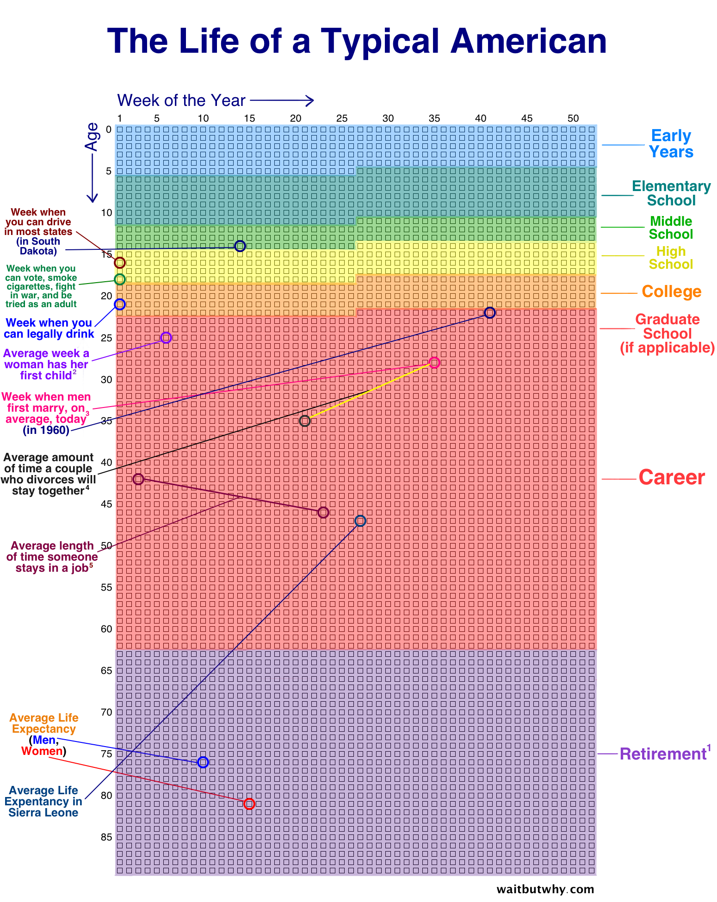

# Life Calendar

Your life, one box per day. An implementation of the idea in [Your Life in Weeks](https://waitbutwhy.com/2014/05/life-weeks.html), at daily resolution: log what happened, give the day a *credit*, paint whole periods of your life with a hue, and watch the mosaic fill in.

<center>

</center>

Sample site: [Life Calendar](https://ssine.ink/LifeCalendar/) (a GitHub Page of this repo). For the story behind it, see [this blog post](https://ssine.ink/posts/life-calendar).

## Features

- **Day grid by year** — each year of life is one block: columns are weeks, rows are weekdays.
- **Colour means something** — a period you never wrote in stays a pale wash; days you actually logged gain both depth and saturation, so records never hide inside a period.
- **Works on a phone** — the year is split into 1 / 2 / 4 stripes (the `S M L` control) so the grid always fits the screen; no horizontal scrolling, ever.
- **Light and dark themes**, following the system by default.
- **Day details** — hover on desktop, tap for a bottom sheet on touch; arrow keys walk day by day.
- **Search** across everything you have logged, with matches ringed in the grid and highlighted in the panel.
- **Life progress** — days lived, days logged, days left, percentage elapsed.
- **Periods legend** — click a period to jump to its first day.
- **Deep links** — every day has a URL (`#2024-10-05`).
- **Encrypted entries** — private lines stay encrypted in the data file (AES-256-GCM) until you enter the passphrase.

Keyboard: <kbd>t</kbd> today · <kbd>/</kbd> search · <kbd>↑</kbd><kbd>↓</kbd> ± a day · <kbd>←</kbd><kbd>→</kbd> ± a week · <kbd>Esc</kbd> close.

## Making it yours

1. Fork the repo and edit [`src/scripts/config.js`](src/scripts/config.js):

   ```js
   export const CONFIG = {
     birth: '1998-04-27',   // day 0
     lifeExpectancy: 102,   // how many years to draw
     motto: '…',            // shown under the title, '' to hide
   };
   ```

2. Put your events in [`events.html`](events.html) (see below).
3. Enable GitHub Pages on the repo. There is no build step — it is plain HTML, CSS and ES modules.

To run it locally, serve the folder (opening `index.html` from the file system will not work, because the page fetches `events.html`):

```bash
python3 -m http.server 4173
```

## Recording a day

`events.html` is written by `tools/add-entry.mjs`, which handles the date
format, escaping, line breaks and encryption:

```bash
node tools/add-entry.mjs --credit 20 --text $'早上写完了 PR\n晚上练腿 🏋️'
node tools/add-entry.mjs --date 2026-08-14 --credit 30 --text '…' --replace
node tools/add-entry.mjs --text '只有我自己看' --secret
node tools/add-entry.mjs --text '…' --print     # preview the markup, write nothing
```

Then `git commit && git push` — GitHub Pages picks it up.

In Claude Code / Cowork there is a `log-day` skill (`.claude/skills/log-day/`)
that does all of this from a sentence about your day, and a scheduled task that
asks about it every evening.

## Data format

Every child of `#events` in `events.html` is one entry. Attributes carry the metadata, the content is the text (simple HTML is fine):

| attribute       | meaning                                                      |
| --------------- | ------------------------------------------------------------ |
| `date`          | a single day, `M/D/YYYY`                                     |
| `start` / `end` | a stretch of days. Leave `end` out (or write `end="now"`) while it is still going — it then runs to today, never into the future |
| `credit`        | how much that day counted, 0–100 — higher means deeper colour |
| `class="base"`  | a life period; paints the base colour under everything else  |
| `hue`           | the period's hue, 0–360 (`base` entries)                     |
| `color`         | override the computed colour for those days                  |
| `icon`          | background image for a single day                            |

```html
<div class="base" credit="10" hue="220" start="06/24/2024"><i>Akuna Capital</i></div>  <!-- still going -->
<div color="#A349A4" date="09/01/2016">升入大学</div>
<div credit="20" date="10/05/2024">几乎在床上躺了一天<br/>晚上出去抓娃娃 🎮</div>
```

Notes:

- Later entries override earlier ones, and credits add up.
- An open period shows a `至今` / `now` badge in the legend.
- The first emoji in a single-day entry is drawn inside its box.
- A line starting with `*v2:` is ciphertext; the passphrase is entered through the lock button and stored only in your browser. See below.

## Private entries

A private line is stored as

```
*v2:base64( iv[12] || AES-256-GCM ciphertext || tag[16] )
```

with the key derived by PBKDF2-SHA-256 (600 000 rounds) from a random salt kept
once on the `#events` element, so the passphrase is stretched a single time per
page load however many entries are encrypted. Both sides are plain WebCrypto —
no library, no CDN. `tools/add-entry.mjs --secret` writes exactly the same
format; it takes the passphrase from `$LIFECAL_KEY`, else the macOS keychain
item `lifecal`:

```bash
security add-generic-password -s lifecal -a key -w
```

Be honest about what this protects: the ciphertext is public on GitHub forever,
so an attacker can grind guesses offline. GCM prevents tampering and the KDF
makes each guess cost real work, but **the passphrase is the whole defence** —
use five or six random words. If something must never leak, keep it out of a
public repo entirely rather than encrypting it.

## Project layout

```
index.html            page shell
src/styles/
  tokens.css          design tokens: colour, type, shape, the cell colour ramp
  base.css            reset and document defaults
  app.css             header, stats, search, footer, buttons
  calendar.css        the grid
  panel.css           day panel / bottom sheet / dialog
src/scripts/
  config.js           your birthday and everything else you may want to change
  main.js             wiring
  events.js           events.html → plain data
  model.js            per-day model (typed arrays + sparse detail map)
  calendar.js         grid rendering, virtualisation, density, selection
  panel.js            day details, popover or bottom sheet
  search.js           free-text search
  stats.js            header numbers and the period legend
  crypto.js           private entries: PBKDF2 + AES-GCM via WebCrypto
  theme.js            system / light / dark
  i18n.js             zh + en strings and date formats
  utils.js            date maths, emoji detection, small DOM helpers
tools/
  add-entry.mjs       writes (and encrypts) a day into events.html
```

A century is about 37 000 days, so year blocks are only built when they come near the viewport; their height is reserved in CSS, which keeps scrolling and deep links exact.

## TODO

- better data format (schema, HTML → jsonl/yaml/etc)
- random motto?
